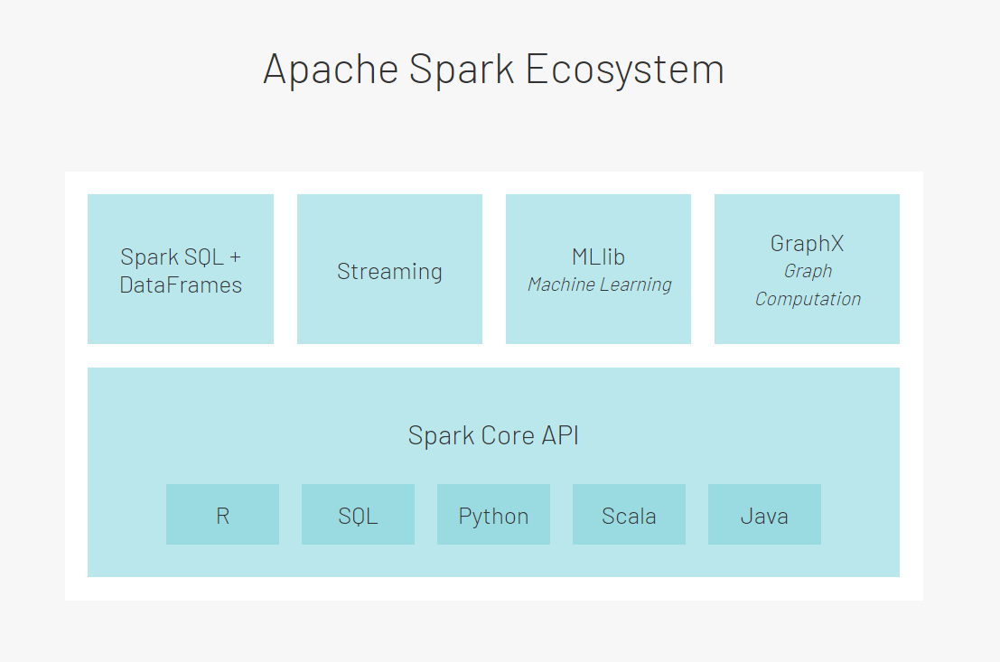
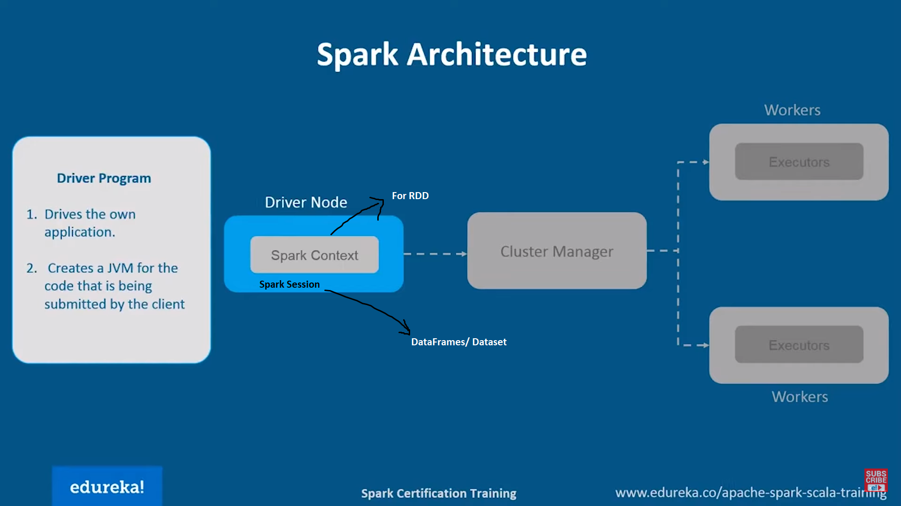
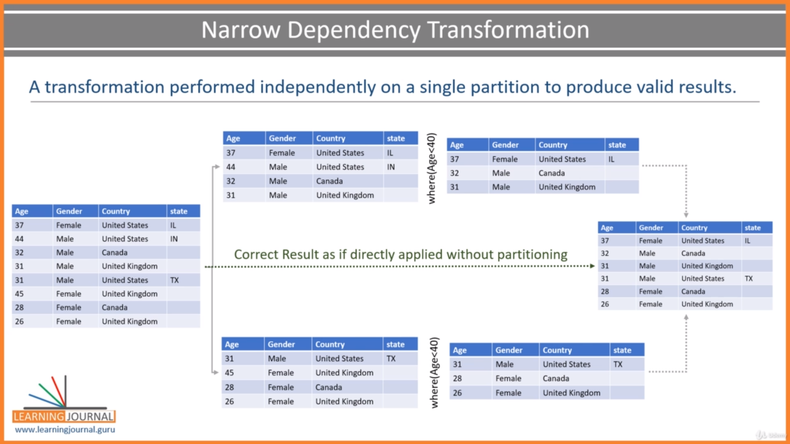
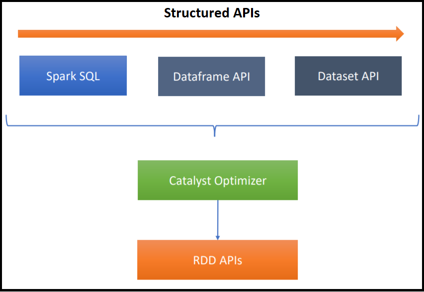

# Spark 
Reference: https://www.udemy.com/course/apache-spark-programming-in-scala/
## Spark Architecutre
<ol>
<li>Spark Core : Used for monitoring, scheduling and processing the task</li> 
<li>Spark API (Polyglots) : Supports Java, Scala, Python and R</li> 
<li>Spark SQL & Dataframes: Uses SQL queries. DF supports functional programming to solve data crunching problem</li> 
<li>MLib: Used for Machine Learning</li> 
<li>GraphX: Used for graphs</li> 
<li>Streaming APIs: Streaming: Consume and Process a continuous stream of data</li> 
<li>Cluster manager : Spark runs on Yarn, Mesos, Kubernetes, Standalone & Local</li> 
<li>Distributed storage : HDFS, Amazon S3, NoSQL, RDBMS</li> 
</ol>

Diagram Reference: https://databricks.com/spark/about


## Advantages
1. Abstraction : Abrastracts distributed architecture and makes feel like working on single machine and executing SQL queries so underlying complexities are hide.
2. Unified processing: Can use polyglot, provides various liberaries to work for Machine Learning & GraphX
3. Ease to use: Complexities are hiden by Spark
4. Fast processing: In memory processing. 10x faster than Hadoop on disc and 100x faster on memory
5. Powerful caching: It has caching management


## Spark Execution Methods
<ol>
<li>Interactive Clients: Using Spark Shell & Notebook. Used for exploration & development purpose</li>
<li>Spark-Submit (Universely accepted method): Program is submitted using submit job. Used in Production</li>
</ol>

## Spark supports 
1. Batch processing (Scheduled job)
2. Stream processing (Kafka integration)

## Spark Cluster Managers
1. Local
2. Yarn
3. Mesos
4. Kubernetes
5. Standalone

## Spark Processing Model
It works on master slave principles. <br/>
Every application has one master and 0 or more executors. </br>
Work is distributed between the executors, who process and returns the results to master. </br>

Diagram Reference: https://www.youtube.com/watch?v=F8pyaR4uQ2g



## Creating Spark Program
Driver has Spark Session (DF/DS) or Spark Context (For RDD).

Spark session is singleton because app has only one driver. 

**Creating Spark Session : Option 1**
```
def main(args : Array[String]) : Unit = {
	val spark = SparkSession.builder()
				.appName("My Spark App")
				.master("local[3]")
				.getOrCreate();
	spark.stop();
}
```


**Creating Spark Session : Option 2**
```
def main(args : Array[String]) : Unit = {
	val sparkConf = new SparkConf();
	sparkConf.set("spark.app.name", "My Spark App");
	sparkConf.set("spark.master", "local[3]");

	val spark = SparkSession.builder()
				.config(sparkConfig)
				.getOrCreate();
	spark.stop();
}

```

**Creating Spark Session : Option 3**</br>
Create the conf/properties file containing all the spark configurations.</br>
Read this file one by one for each key value and add it to .config


## Configuring the Spark session 
**Precedence order:**
1. Configuration in the program (highest precendence)
2. Command line arg 
3. Default config file
4. Environment variables (lowest precedence)

## Dataframe
DF is immutable data structure. i.e. once created cannot be modified.
DF has 
<ol>
<li>column names </li> 
<li>associated data types</li>
</ol>

Spark (with the help of Cluster manager) will assign the closest partitions assigned to DF to avoid the network latency.

## Spark Transformation
They like SQL like operations and form a DAG (Directed Acyclic Graph).

DAG has 
1. Transformations : 
	<ul>
	<li>It produces another DF.</li>
	<li>select, groupby, where are examples</li>
	<li>e.g. df.select("col1", "col2")</li>
	<li>They are again divided in to </li>
		<ol>
			<li>Narrow Transformation : Performs an operation of single partition and produces a valid result</li>
			<li>Wide Transformation: Data requires from other partiotions to get a correct result. It requires <b>shuffle/sort exchange</b> to bring logical data together.</li>
		</ol>
		
	<li><b>Lazy evaluations:</b> Transformations are not executed directly. Driver reviews the transformations and optimize them before executing action.</li>
	</ul>




2. Actions:
	<ol>
		<li>Read</li>
		<li>Write</li>
		<li>Collect : Used for Production code as it is array and provides more control</li>
		<li>Show: Used for devleopment/debugging purpose to save the time</li>
	</ol>
	
	
## Spark execution plan
1. <b>Jobs</b> are created when action is executed
2. <b>Stages</b> are created when job performs a wide dependency transformation. Stage may write a data in write exchange and read from read exchange
3. <b>Tasks</b> are the unit of work those would be executed by executors


## Structured APIs (RDD, DataFrames, DataSet, SQL)
<b>RDD:</b> Low level API and present at core. Not recommanded by Spark community as it lags Catalyst optimizer. But used when schema is not assigned. They are fault tolerant (If executor fails while processing the partition, driver assigns those tasks to another executor)

<b>DataFrames:</b> Associated with Generic type  (ROW)

<b>DataSet:</b> Lang native APIs for Java & Scala. Not applicable in Python. Tied to a schema and associated with specific type

<b>Spark SQL:</b> Recommanded by Spark, as it performs efficient operations. They are like SQL queries and hides the underlying complexities

Diagram Reference: https://www.udemy.com/course/apache-spark-programming-in-scala/

